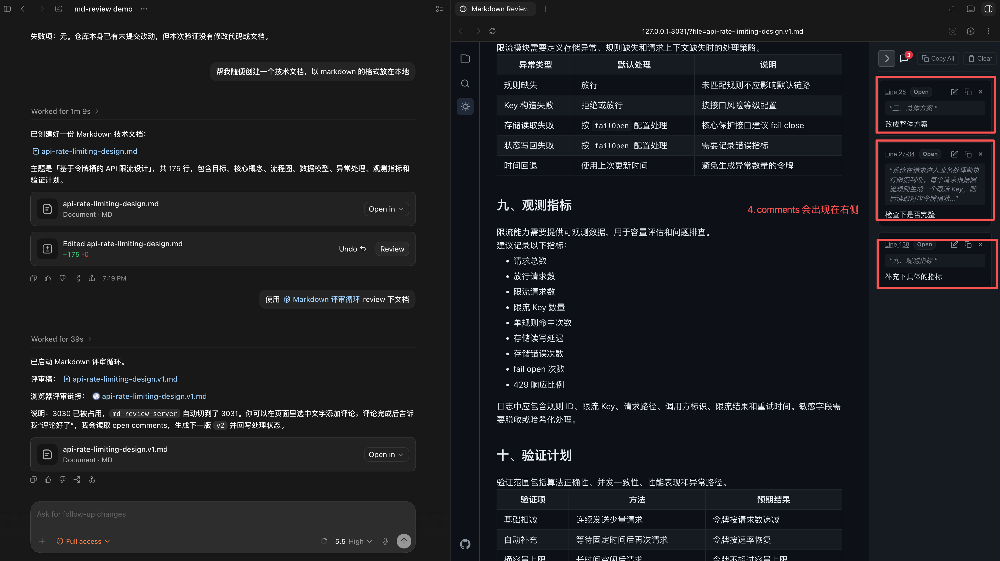

# md-review-server

[](https://www.npmjs.com/package/md-review-server)
[](./LICENSE)
[](https://github.com/tracyxiong1/md-review-server)


`md-review-server` 是面向 Codex 的本地 Markdown 可视化评审工具。

在 Codex 中，纯对话方式适合提出整体修改要求，但不方便对长文中的具体文本进行圈选和批注。`md-review-server` 提供浏览器评审页面和 `markdown-review-loop` skill，让用户可以在浏览器中阅读 Markdown、留下局部评论，再由 Codex 根据评论生成下一版文档，形成“批注 -> 修订 -> 再评审”的迭代流程。

## 使用场景

- 需要在浏览器里阅读 Markdown，并对具体段落做批注。
- 需要让 Codex 根据批注生成下一版文档。
- 需要对技术方案、README、机制说明、复盘草稿做多轮修改。
- 需要保留 `v1`、`v2`、`v3` 等多个版本，方便回看每轮改动。

适合处理的问题包括：

- 章节结构需要调整。
- 表达不够清晰，需要重写。
- 某段内容缺少背景、边界或结论。
- 长文需要分轮评审，先看结构，再看内容，再看措辞。

## 示意流程

| 1. 进入流程                                         | 2. Review & comment                                               | 3. Review & comment                                               | 4. Review 完毕，提交                                            | 5. 查看结果 & loop                                                 |
| --------------------------------------------------- | ----------------------------------------------------------------- | ----------------------------------------------------------------- | --------------------------------------------------------------- | ------------------------------------------------------------------ |
|  |  |  |  |  |

## 快速开始

### 安装

推荐让 Codex 自动安装：

```text
帮我安装 skill：https://www.npmjs.com/package/md-review-server
```

也可以手动安装：

```sh
npx -y md-review-server@latest skill install
```

检查状态：

```sh
npx -y md-review-server@latest skill doctor
```

看到 `Status: up to date` 即可使用。

### 启动评审循环

在 Codex 中输入：

```text
使用 $markdown-review-loop 帮我启动 docs/example.md 的评审循环。
```

Codex 会打开本地评审页面。用户在浏览器中阅读文档，并对需要修改的位置创建评论。

### 在浏览器中评论

在浏览器中操作：

1. 选中需要修改的文字。
2. 点击 `Comment`。
3. 输入评论。
4. 提交评论。

### 让 Codex 生成下一版

评论完成后，回到 Codex 输入：

```text
评论完了
```

Codex 会根据评论生成新版本，例如：

```text
example.v1.md -> example.v2.md
```

### 继续评审

如果还需要继续修改，在浏览器中切换到新版文档，继续评论。然后对 Codex 说：

```text
我已经在 v2 上补充了新评论，继续生成 v3。
```

推荐使用版本化文件名：

```text
example.v1.md
example.v2.md
example.v3.md
```

查看历史版本：


### 常用话术

启动评审：

```text
使用 $markdown-review-loop 帮我启动这份 Markdown 的评审循环。
```

生成下一版：

```text
评论完了，读取评论并生成下一版。
```

继续下一轮：

```text
我已经在新版上补充了评论，继续处理。
```

## 手动启动 Review Server

不使用 Codex skill 时，可以直接启动本地评审页面：

```sh
npx -y md-review-server@latest docs --port 3030 --active-file docs/guide.md
```

也可以全局安装：

```sh
npm install -g md-review-server
md-review-server docs --port 3030
```

默认只监听 `127.0.0.1`。如果使用 `--host 0.0.0.0`，服务会在启动时输出安全提示。

## 主要能力

- 内置 `markdown-review-loop` Codex skill，可通过 npm 安装和更新
- 按原始结构预览 Markdown 和 MDX 文件
- 解析并展示 Frontmatter 元数据
- 对选中文本和指定行范围创建评论
- 编辑和删除已有评论
- 将评论持久化到 `.reviews/*.review.json`
- 通过 HTTP API 读取评论和更新处理状态
- 在目录模式中通过文件树选择 Markdown 文件
- 支持深色模式，跟随系统偏好
- 支持可调整、可折叠的评论侧边栏
- 点击评论行号跳转到对应内容
- Markdown 文件变更后通过 SSE 自动刷新

## 评论管理

### 添加评论

1. 在 Markdown 预览区域选择文本
2. 点击出现的 `Comment` 按钮
3. 输入评论内容
4. 按 `Cmd/Ctrl+Enter` 或点击 `Submit`

### 编辑评论

1. 点击评论上的编辑按钮
2. 修改文本框中的内容
3. 按 `Cmd/Ctrl+Enter` 或点击 `Save`
4. 按 `Escape` 或点击 `Cancel` 放弃修改

### 快捷键

- `Cmd/Ctrl+Enter`：提交或保存评论
- `Escape`：取消编辑
- `Cmd+K`：目录模式中聚焦搜索框

## CLI 使用方式

```sh
md-review-server [options]              # 浏览当前目录下的 Markdown 文件
md-review-server <file> [options]       # 预览单个 Markdown 文件
md-review-server <directory> [options]  # 浏览指定目录下的 Markdown 文件
```

### 参数

```sh
-p, --port <port>           服务端口，默认 3030
    --host <host>           监听地址，默认 127.0.0.1
    --review-dir <dir>      review sidecar 目录，默认 .reviews
    --active-file <file>    目录模式下初始选中的文件
    --readonly              禁用评论写入 API
    --no-open               不自动打开浏览器
    skill <command>         安装、更新或检查内置 Codex skills
-h, --help                  显示帮助信息
-v, --version               显示版本号
```

### 示例

```sh
md-review-server
md-review-server docs
md-review-server README.md
md-review-server docs/guide.mdx
md-review-server docs --active-file docs/guide.md --port 8080
md-review-server skill install
md-review-server skill update --force
```

## 进阶说明

### 评论数据

评论由服务端写入 Markdown 所在 review 目录：

```text
docs/.reviews/guide.v2.review.json
```

review 文件使用 JSON 存储，核心字段包括：

```json
{
  "schemaVersion": 1,
  "document": "guide.v2.md",
  "comments": [
    {
      "id": "c001",
      "file": "guide.v2.md",
      "startLine": 12,
      "endLine": 12,
      "startOffset": 4,
      "endOffset": 18,
      "selectedText": "selected text",
      "beforeText": "before",
      "afterText": "after",
      "comment": "需要补充说明",
      "status": "open"
    }
  ]
}
```

支持的评论状态：

- `open`：待处理
- `resolved`：已处理
- `partially_resolved`：部分处理
- `unresolved`：无法处理，需记录原因
- `ignored`：明确跳过

### HTTP API

#### 获取会话信息

```sh
curl http://127.0.0.1:3030/api/session
```

#### 获取待处理评论

```sh
curl 'http://127.0.0.1:3030/api/comments?file=guide.v2.md&status=open'
```

#### 创建评论

```sh
curl -X POST 'http://127.0.0.1:3030/api/comments' \
  -H 'Content-Type: application/json' \
  -d '{
    "file": "guide.v2.md",
    "startLine": 12,
    "endLine": 12,
    "selectedText": "selected text",
    "comment": "需要补充说明"
  }'
```

#### 批量回写状态

```sh
curl -X PATCH 'http://127.0.0.1:3030/api/comments' \
  -H 'Content-Type: application/json' \
  -d '{
    "updates": [
      {
        "id": "c001",
        "file": "guide.v2.md",
        "status": "resolved",
        "targetFile": "guide.v3.md",
        "resolution": "已补充说明。"
      }
    ]
  }'
```

## 本地开发

```sh
pnpm install
pnpm dev
pnpm test
pnpm build
pnpm lint
```

## 发布流程

项目使用 GitHub Actions 和 npm Trusted Publishing 发布 npm 包，不需要在 GitHub Secrets 中保存长期 `NPM_TOKEN`。

npm 包后台需要配置 Trusted Publisher：

- Package：`md-review-server`
- Publisher：GitHub Actions
- Owner：`tracyxiong1`
- Repository：`md-review-server`
- Workflow filename：`release-please.yml`

发布步骤：

1. 使用语义化 commit 合并改动到 `main`
2. `release-please` 自动创建或更新 release PR
3. 合并 release PR 后，workflow 创建 GitHub Release 和版本 tag
4. 同一个 workflow 在 tag 对应代码上执行 `lint`、`test`、`build`
5. 验证 npm 上不存在同版本后，通过 OIDC 发布到 npm

也可以手动创建版本 tag 触发同一个发布流程：

```sh
npm version patch
git push origin main --tags
```

发布完成后可验证：

```sh
npm view md-review-server version --registry=https://registry.npmjs.org/
npx -y md-review-server@latest skill doctor
```

## License

[MIT](./LICENSE)
